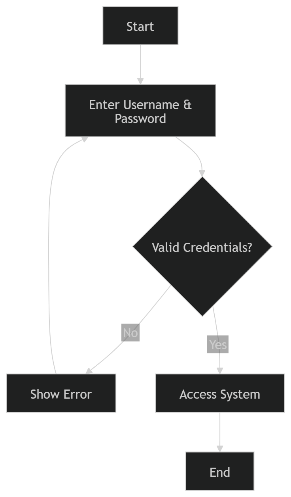
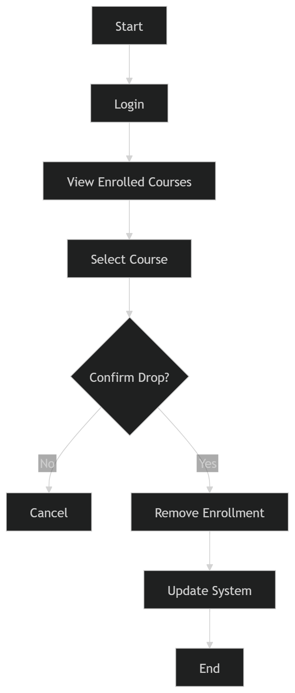
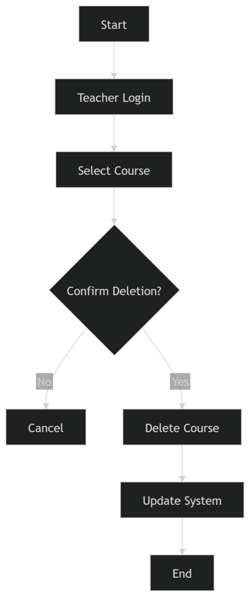
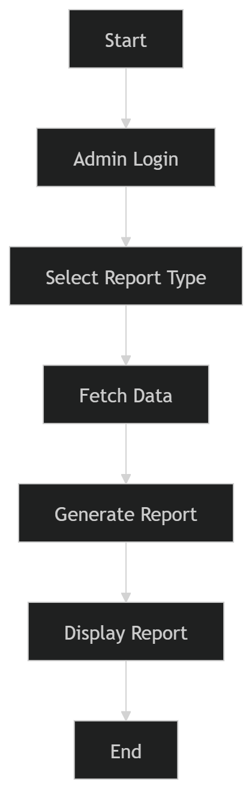
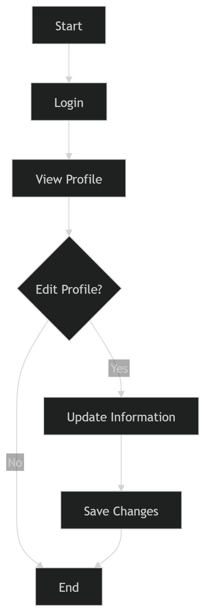
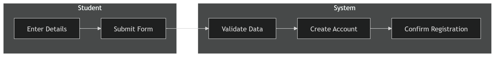
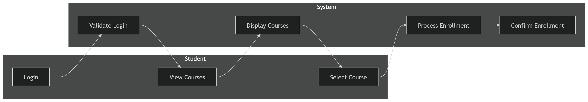
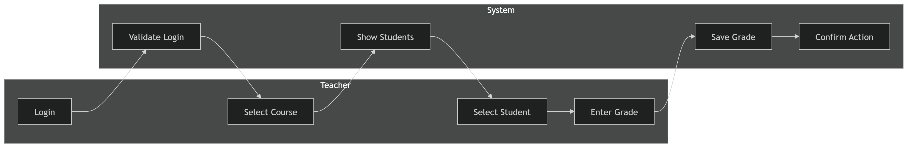
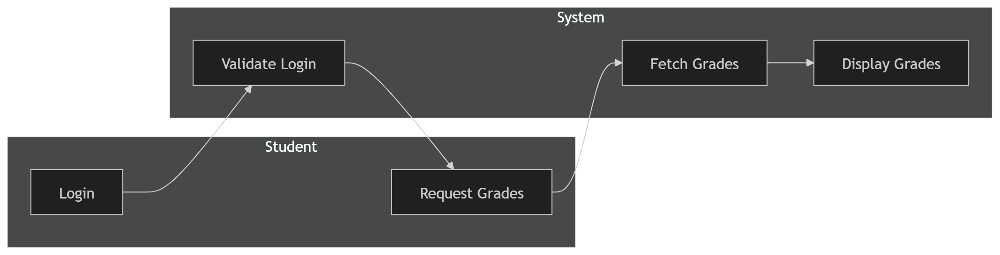
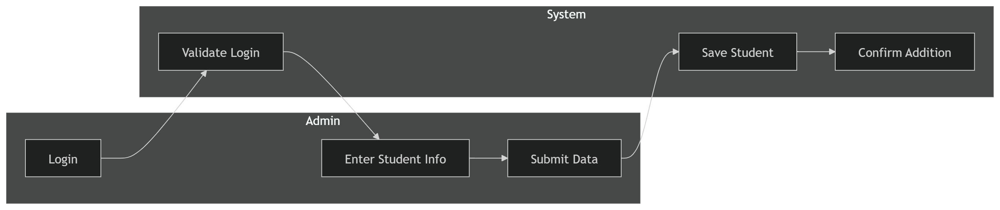

#  Student Information System

##  Project Description

This project is a Student Information System designed to manage students, courses, teachers, and administrative operations.
It allows different users (Student, Teacher, Admin) to interact with the system based on their roles.

---

##  Actors

* Student
* Teacher
* Admin

---

##  Features

* User registration and login
* Course enrollment and management
* Grade assignment and tracking
* Student and teacher management
* Report generation

---

##  Diagrams

###  Activity Diagrams

#### Login



#### Drop Course



#### Delete Course



#### Generate Report



#### Update Profile



---

###  Swimlane Diagrams

#### Register



#### Enroll in Course



#### Assign Grade



#### View Grades



#### Add Student



---

##  Project Structure

```
Student-Information-System/
│
├── diagrams/
│   ├── activity/
│   ├── swimlane/
│   ├── state/
│   └── erd/
│
├── docs/
│   ├── use-cases.md
│   ├── requirements.md
│
├── README.md
```

---

##  Technologies

* UML Diagrams
* GitHub
* Draw.io

---

##  Notes

This project is developed as part of the Software Modeling and Design course.
